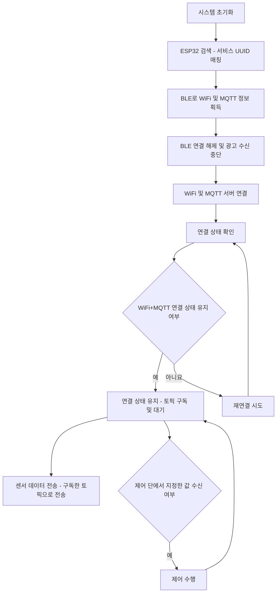
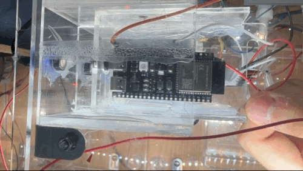
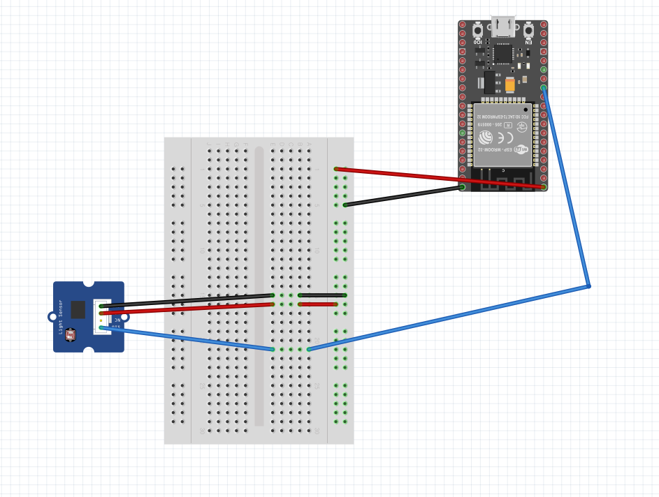
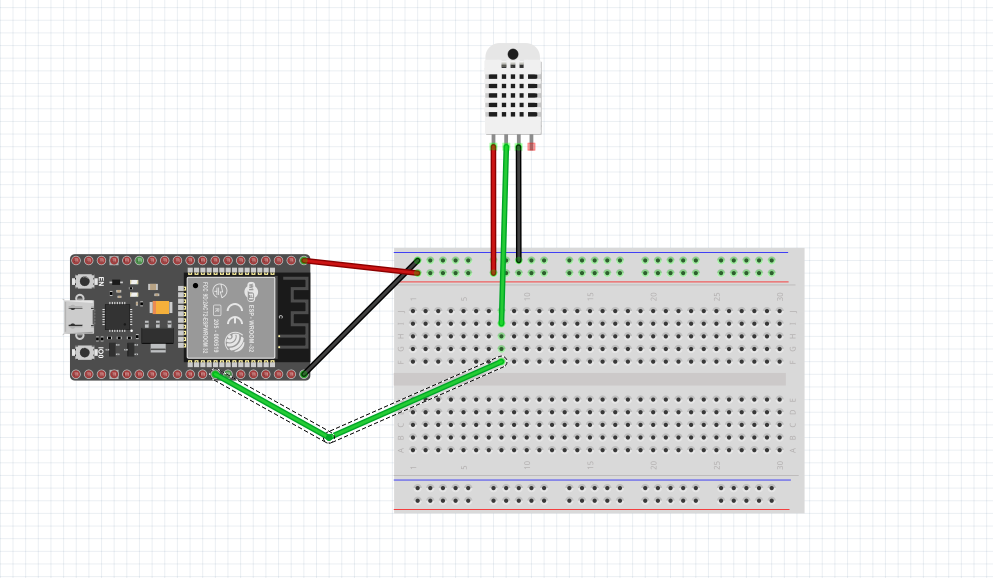
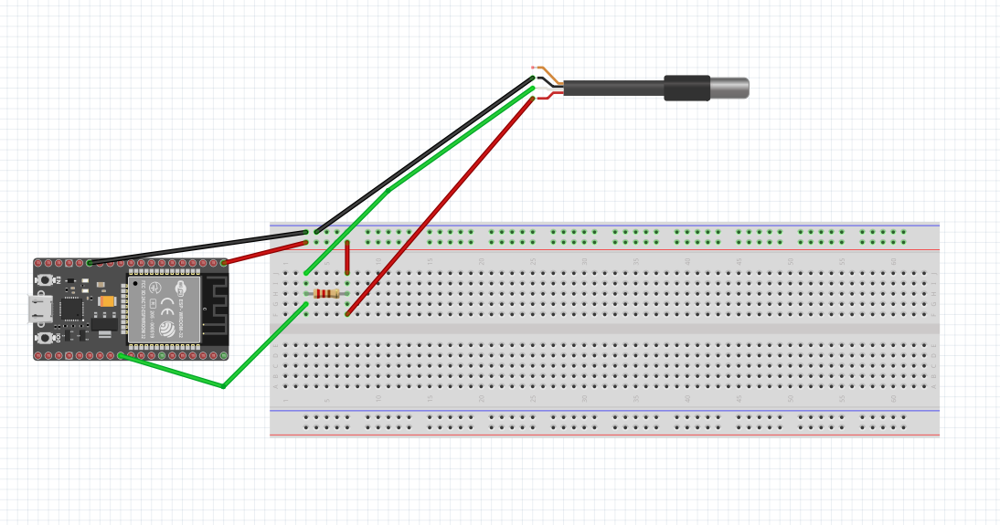
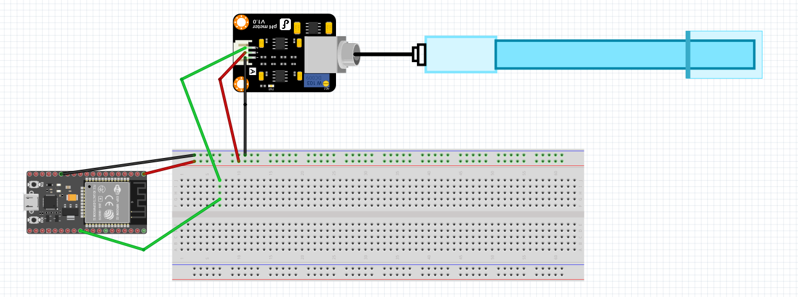
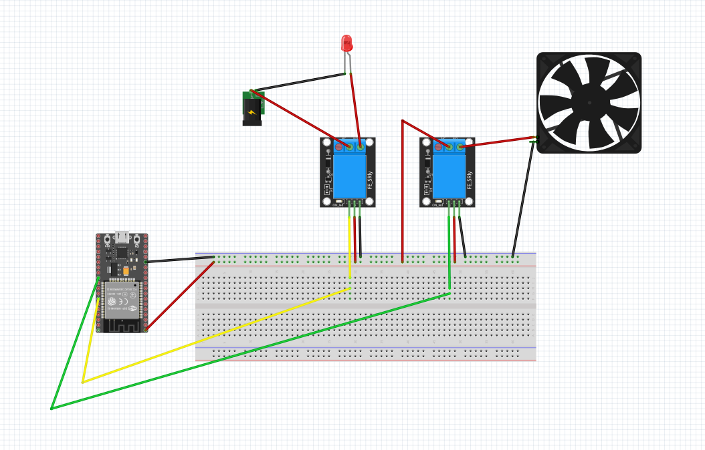
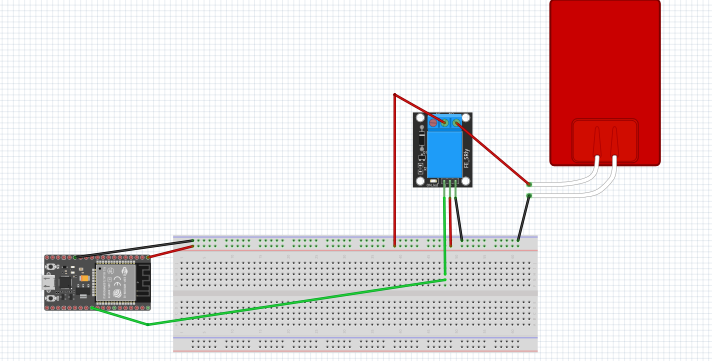
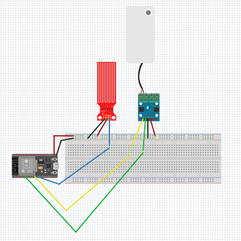

# PLKIT-EM.module

# 🏅PLKIT-EM

**BLE 통신을 통한 스마트팜 모듈화**

## 목차

- 프로젝트 진행 기간
- 개요
- 주요 기능
- EM 흐름도 
- 서비스 화면
- 주요 기술
- 아두이노 회로도
- 센서 및 제어

---

### 🎞 프로젝트 진행 기간

2024.05.10 ~ 2024.11.01

### ✨ 개요

이 프로젝트는 BLE 통신을 활용하여 Wi-Fi 및 MQTT 정보를 모듈에 전달하고, 이를 통해 스마트팜의 모듈을 유연하게 구성할 수 있도록 하는 기능을 제공합니다. 각 모듈이 독립적으로 Wi-Fi와 MQTT 네트워크에 연결될 수 있어 유지보수와 관리가 용이해지며, 사용자 편의성을 높여줍니다.

### 💻 주요 기능

- **BLE 통신을 통한 정보 전송**: Wi-Fi 및 MQTT 정보를 BLE로 전달하여 스마트팜 모듈화를 실현.
- **LED, 팬, 히터 제어**: 사용자 인터페이스에서 LED, 팬, 히터를 실시간으로 제어 가능.
- **실시간 수위 확인 및 조절**: 사용자가 스마트팜 수위를 실시간으로 확인하고 필요에 따라 모터로 수위를 조절할 수 있습니다.
- **ESP32 카메라 모니터링**: ESP32 카메라를 통해 스마트팜을 실시간으로 모니터링하여, 스마트팜 환경을 지속적으로 관찰할 수 있습니다.
- **자동 순환 기능**: Node-RED 제어를 통해 설정된 일정 시간마다 농장의 물을 자동으로 순환시켜, 식물에 필요한 수분 공급을 자동화합니다.
- **모듈화 기능**: 마그네틱 충전기를 통한 손쉬운 모듈 탈부착으로 유연한 구성 가능.
### 📊 EM 흐름도

### 🖼 구현 장면

- **마그네틱 충전기를 이용한 모듈화**
    
    
    

- **LED 및 팬 제어 화면**
    
    
    

### 🛠 주요 기술

- **Arduino IDE**: 코드 작성 및 전체적인 회로 설계
- **Node-RED**: 주기적인 자동 순환 제어
- **ESP32 카메라**: 스마트팜 환경을 실시간으로 모니터링하는 데 사용.

### 🔌 아두이노 회로 구성

### 📟 센서 및 제어

## 센서

### 1️⃣ 조도 측정

프로젝트에는 CDS 광전지(조도 센서)가 포함되어 있어 스마트팜 환경의 현재 조도 수준을 측정합니다. 이 센서는 조도를 모니터링하여 식물 성장에 최적의 빛 조건을 유지하는 데 도움을 줍니다.

### 2️⃣ 온도 및 습도 측정

DHT22 온습도 센서를 사용하여 스마트팜의 환경 조건을 모니터링합니다. 이 센서는 온도와 습도에 대한 실시간 데이터를 제공하여 식물 건강을 위한 이상적인 환경을 유지하는 데 도움을 줍니다.

### 3️⃣ 수온 측정

수온 센서를 사용하여 스마트팜의 물 온도를 측정합니다. 이는 물이 식물에게 최적의 조건을 제공할 수 있도록 도와 식물의 건강과 성장에 기여합니다.

### 4️⃣ TDS (총 용존 고형물) 측정

TDS 센서를 사용하여 물 속의 용존 고형물 농도를 모니터링합니다. 스마트팜 환경에서 중요한 이 측정값은 물의 품질에 대한 통찰력을 제공하여 식물 성장에 최적화된 영양 균형을 유지하는 데 도움을 줍니다.

## 제어

### 1️⃣ LED 및 팬 제어

프로젝트에는 스마트팜 내부에서 조명과 팬 작동을 제어할 수 있는 시스템이 포함되어 있어 사용자가 필요에 따라 설정을 조정할 수 있습니다. 회로도에서는 일반 LED로 표시되지만, 실제 조명은 식물 성장에 최적화된 스펙트럼과 강도를 제공하는 스마트팜 전용 LED입니다. 사용자는 팬을 제어하여 공기 흐름을 조정함으로써 습도를 조절하고, 건강한 식물 환경을 유지할 수 있습니다.

### 2️⃣ 히터 제어

프로젝트에서는 스마트팜 환경에서 히터를 제어할 수 있습니다. 히터를 조정하여 온도를 조절하고 따뜻하고 안정적인 환경을 제공하여, 특히 추운 조건에서 식물 성장에 도움이 되도록 합니다.

## 센서+제어

### 1️⃣ 수위 모니터링 및 제어

프로젝트는 단일 보드에서 수위 센서와 모터 드라이버를 통합하여 스마트팜 내에서 수위를 동시에 모니터링하고 제어할 수 있도록 합니다. 이 구성은 실시간 수위 데이터 전송과 모터 제어를 단일 보드에서 가능하게 하여 관리가 간편하고 식물 건강을 위해 필요한 수위 조정을 효율적으로 수행할 수 있습니다.

### 👩‍💻 야생화 EM 담당자: 김영민